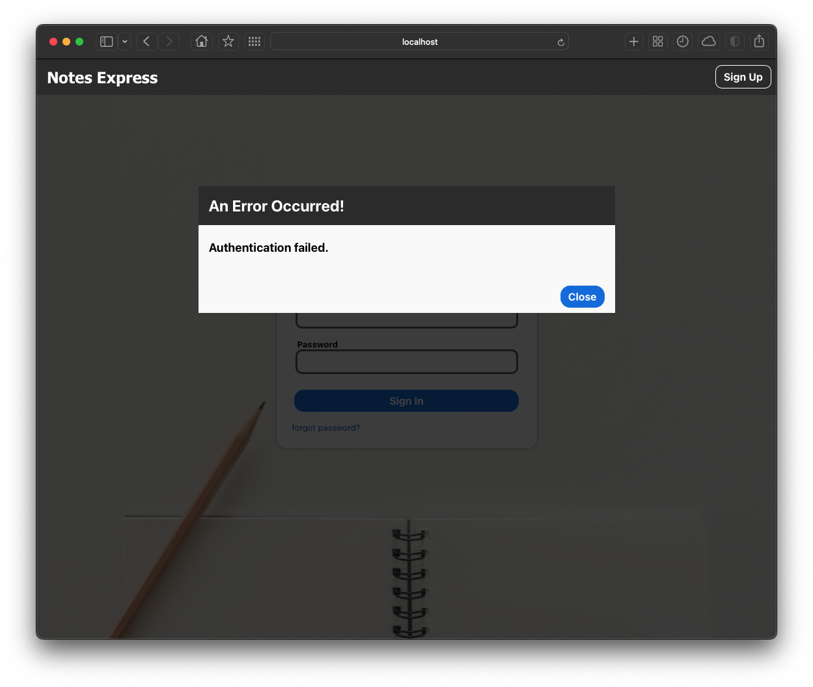
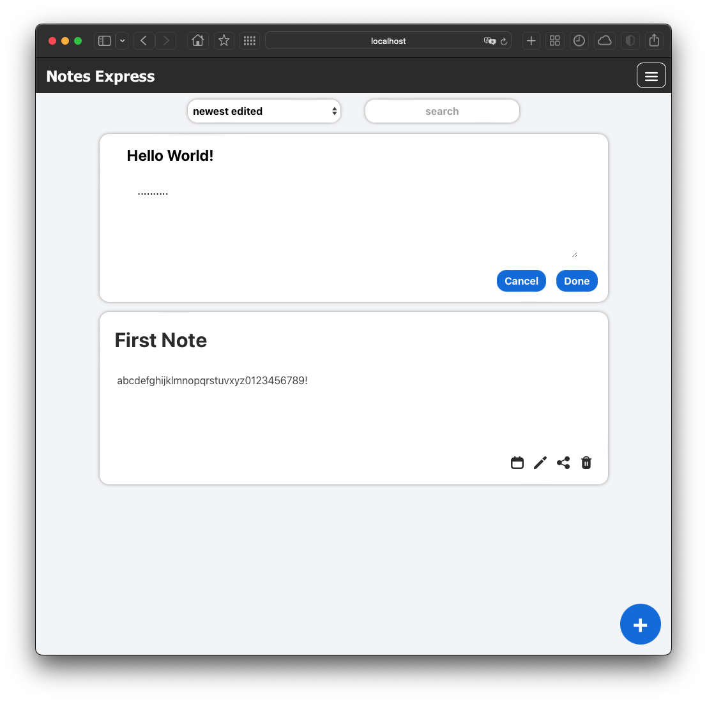

# Note-Taking App

## Developed with:

- MERN full-stack.

## Screenshots

 
 
 
 
 
 
 
 
 

## Features

- User login, signup, logout, forgot password, reset password.
- Auto-login with refresh token after JWT expires, and auto-logout when not authenticated.
- CRUD operations.
- Share notes with guest users setting expiration time and read_only or read_and_write permissions.
- View or edit note shared with you, as a guest user.
- Filter notes with search bar, and sort notes by creation and update dates.
- Loading spinner when fetching backend, and error modal if backend response not ok.
- REST API backend that issues jwt access and refresh tokens for protected endpoints.
